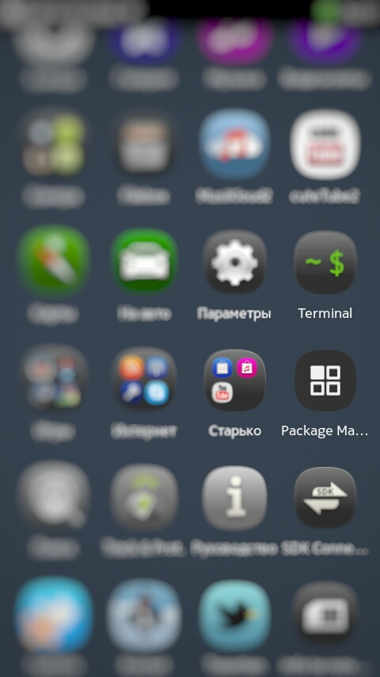
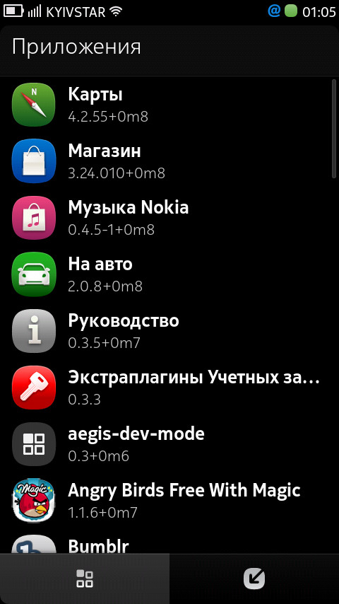

What is it?
===

It is a launcher button of package-manager-ui of **Nokia N9**. The package-manager-ui is a program where you can see, update and/or delete your programs.

 

How-to
---

Copy **package-manager.desktop** to `/usr/share/applications`. For example you can copy **package-manager.desktop** to **MyDocs** directory of your **Nokia N9** from your PC or other devices and follow next commands in terminal:

```
devel-su
//set a password e.g. rootme

cp /home/user/MyDocs/package-manager.desktop /usr/share/applications

exit
```

After you done it you can see new icon on home screen.

Contacts
---

If you find bug or have questions you can find me on Twitter: [@EmgrtE](https://twitter.com/EmgrtE)
